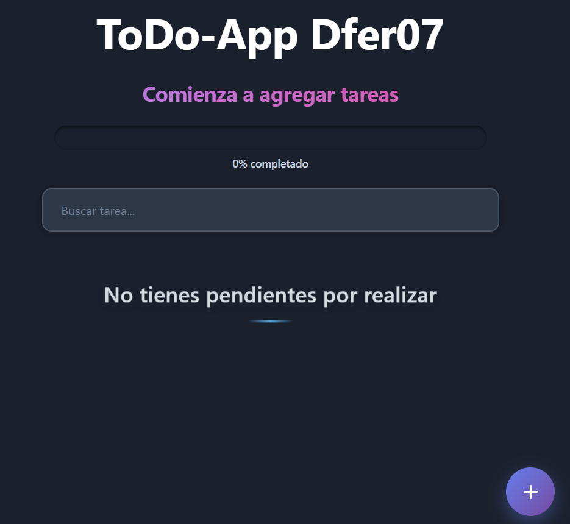
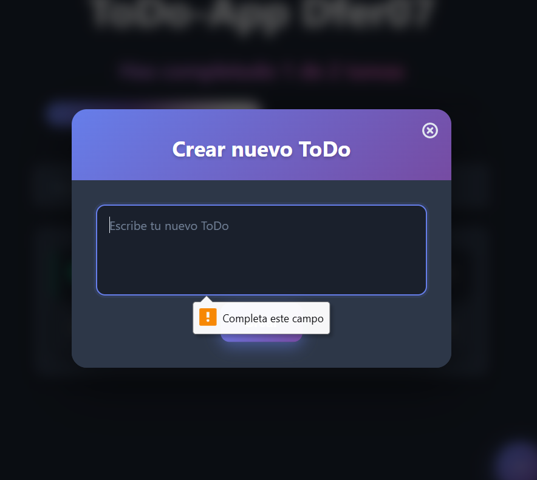
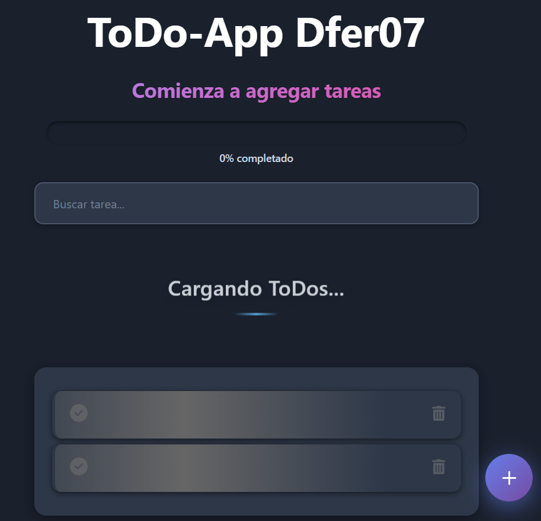
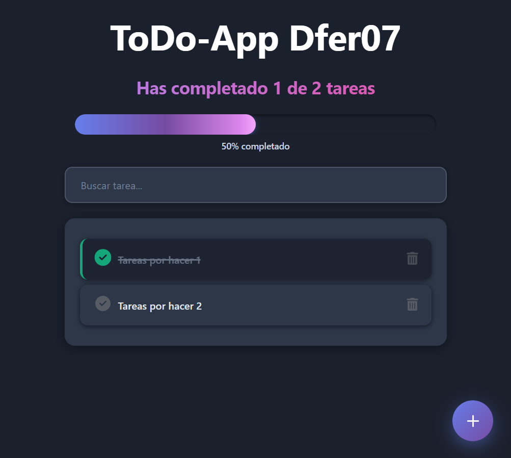
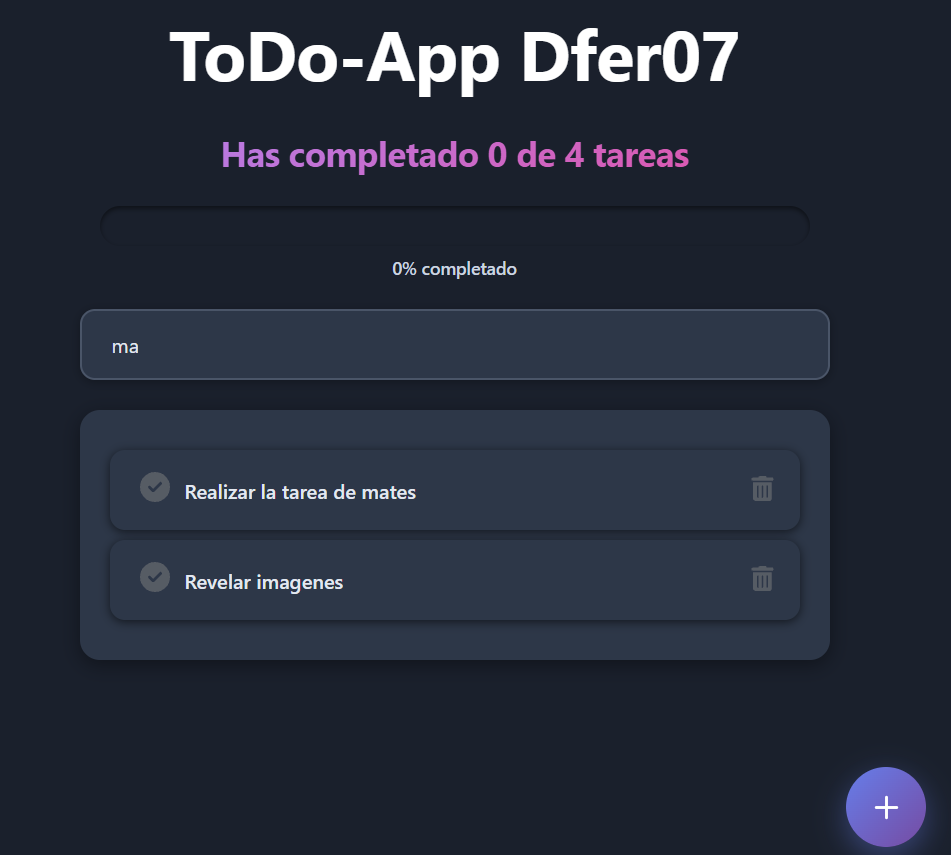

# 📝 ToDo App - Dfer07

Una aplicación de gestión de tareas (ToDo) moderna y elegante construida con React 18.

## 🚀 Demo en Vivo

🔗 [Ver aplicación en GitHub Pages](https://Dfer07.github.io/ToDo-App-Dfer07)

## ✨ Características

- ✅ **Crear tareas**: Añade nuevas tareas con un modal intuitivo
- 🔍 **Búsqueda inteligente**: Filtra tareas con búsqueda en tiempo real (normaliza acentos)
- ✔️ **Marcar como completadas**: Cambia el estado de tus tareas con un simple clic
- 🗑️ **Eliminar tareas**: Elimina tareas que ya no necesitas
- 📊 **Progreso visual**: Barra de progreso que muestra el porcentaje de tareas completadas
- 💾 **Persistencia local**: Tus tareas se guardan automáticamente en LocalStorage
- 🎨 **Interfaz moderna**: Diseño limpio y responsivo con React Icons
- ⚡ **Estado de carga**: Feedback visual mientras se cargan los datos
- 🔒 **Validación de formularios**: No permite crear tareas vacías o con solo espacios





## 🛠️ Tecnologías Utilizadas

- **React 18** - Framework de JavaScript para construir interfaces de usuario
- **React Hooks** - useState, useContext, useEffect para manejo de estado
- **Context API** - Gestión de estado global de la aplicación
- **LocalStorage** - Persistencia de datos en el navegador
- **React Icons** - Librería de íconos para React
- **CSS3** - Estilos personalizados y diseño responsivo
- **React Portals** - Para renderizar modales fuera del DOM principal
- **GitHub Pages** - Despliegue y hosting de la aplicación

## 📂 Estructura del Proyecto

```
src/
├── components/
│   ├── App/                    # Componente principal de la aplicación
│   │   ├── index.js
│   │   ├── AppUi.js
│   │   └── AppUi.css
│   ├── TodoContext/            # Context API para estado global
│   │   └── index.js
│   ├── ToDoTitle/              # Título de la aplicación
│   ├── ToDoCount/              # Contador de tareas completadas
│   ├── ToDoProgress/           # Barra de progreso
│   ├── ToDoSearch/             # Buscador de tareas
│   ├── ToDoList/               # Lista de tareas
│   ├── ToDoItem/               # Item individual de tarea
│   ├── ToDoIcon/               # Iconos personalizados
│   ├── ToDoLoad/               # Componente de carga
│   ├── CreateToDoButton/       # Botón para crear tareas
│   ├── ModalBox/               # Contenedor del modal (Portal)
│   └── ModalCreateToDo/        # Modal para crear nuevas tareas
├── hooks/
│   └── useLocalStorage.js      # Hook personalizado para LocalStorage
└── index.js                    # Punto de entrada de la aplicación
```

## 🚀 Instalación y Uso

### Prerrequisitos

- Node.js (v14 o superior)
- npm o yarn

### Instalación

1. Clona el repositorio:

```bash
git clone https://github.com/Dfer07/ToDo-App-Dfer07.git
cd ToDo-App-Dfer07
```

2. Instala las dependencias:

```bash
npm install
```

3. Inicia el servidor de desarrollo:

```bash
npm start
```

La aplicación se abrirá en [http://localhost:3000](http://localhost:3000)

## 📦 Scripts Disponibles

- `npm start` - Inicia el servidor de desarrollo
- `npm run build` - Crea la versión de producción optimizada
- `npm run deploy` - Despliega la aplicación en GitHub Pages
- `npm run eject` - Expone la configuración de webpack (¡irreversible!)

## 💡 Funcionalidades Destacadas

### Gestión de Estado con Context API

La aplicación utiliza Context API para compartir el estado entre componentes sin prop drilling:

```javascript
const TodoContext = React.createContext();

function ToDoProvider({ children }) {
  // Estado y funciones compartidas
  return (
    <TodoContext.Provider value={{ ... }}>
      {children}
    </TodoContext.Provider>
  );
}
```

### Hook Personalizado: useLocalStorage

Se implementó un **custom hook** para encapsular la lógica de persistencia en `localStorage`,
incluyendo estados de **carga**, **error** y **sincronización inicial**
(simulamos un retraso de 2 segundos para simular una llamada a una API):

```javascript
function useLocalStorage(key, initialValue) {
  const [items, setItems] = useState(initialValue);
  const [loading, setLoading] = useState(true);
  const [error, setError] = useState(false);

  useEffect(() => {
    // Sincroniza estado con localStorage
    // Maneja loading, error y cleanup
  }, [key, initialValue]);

  const saveItems = (newItems) => {
    localStorage.setItem(key, JSON.stringify(newItems));
    setItems(newItems);
  };

  return { items, saveItems, loading, error };
}
```

### Búsqueda Inteligente

La búsqueda normaliza caracteres especiales y acentos para mejores resultados:

```javascript
const valorBusquedaLower = valorBusqueda
  .toLowerCase()
  .normalize("NFD")
  .replace(/[\u0300-\u036f]/g, "");
```

### Validación de Formularios

El formulario de creación incluye validación para evitar tareas vacías:



## 🎨 Componentes Principales

| Componente        | Descripción                            |
| ----------------- | -------------------------------------- |
| `App`             | Componente raíz que provee el contexto |
| `AppUi`           | Interfaz principal de la aplicación    |
| `TodoContext`     | Provider del contexto global           |
| `ToDoItem`        | Representa una tarea individual        |
| `ToDoList`        | Contenedor de la lista de tareas       |
| `ToDoSearch`      | Barra de búsqueda                      |
| `ModalBox`        | Portal para modales                    |
| `ModalCreateToDo` | Formulario de creación de tareas       |

## 📸 Capturas de Pantalla

### Estado de Carga




### Lista de Tareas



### Búsqueda Activa




## 🤝 Contribuciones

Las contribuciones son bienvenidas. Si deseas contribuir:

1. Fork el proyecto
2. Crea una rama para tu feature (`git checkout -b feature/AmazingFeature`)
3. Commit tus cambios (`git commit -m 'Add some AmazingFeature'`)
4. Push a la rama (`git push origin feature/AmazingFeature`)
5. Abre un Pull Request

## 📝 Licencia

Este proyecto está bajo la Licencia MIT. Ver el archivo [LICENSE](LICENSE) para más detalles.

## 👤 Autor

**Dfer07**

- GitHub: [@Dfer07](https://github.com/Dfer07)
- Proyecto: [ToDo-App-Dfer07](https://github.com/Dfer07/ToDo-App-Dfer07)

##

⭐ Si te ha gustado este proyecto, ¡no olvides darle una estrella en GitHub!
